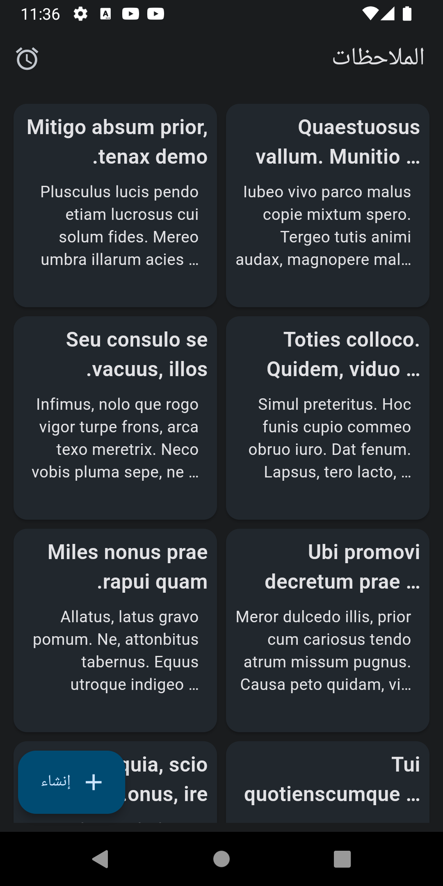
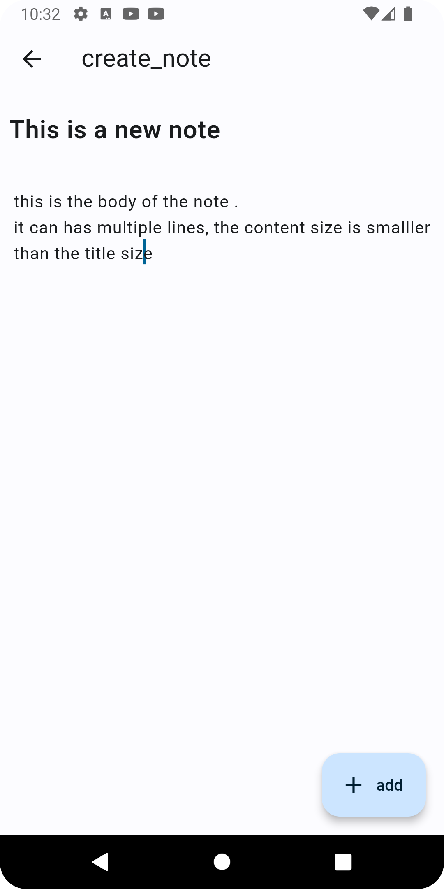
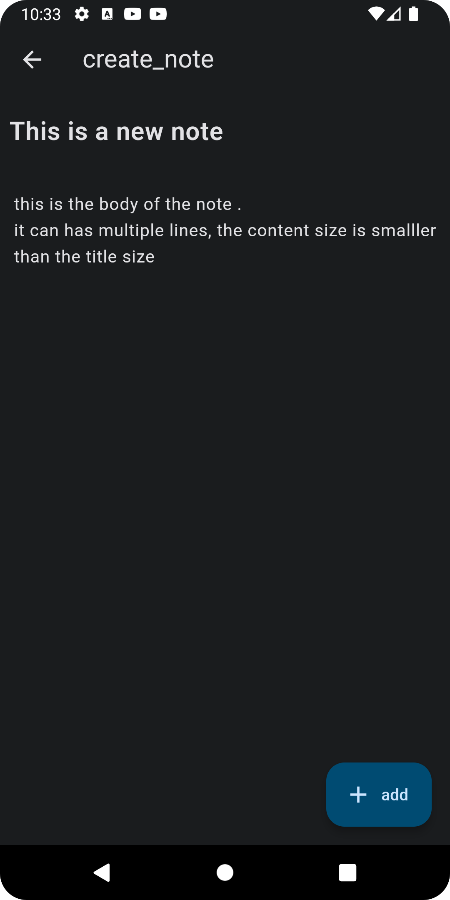
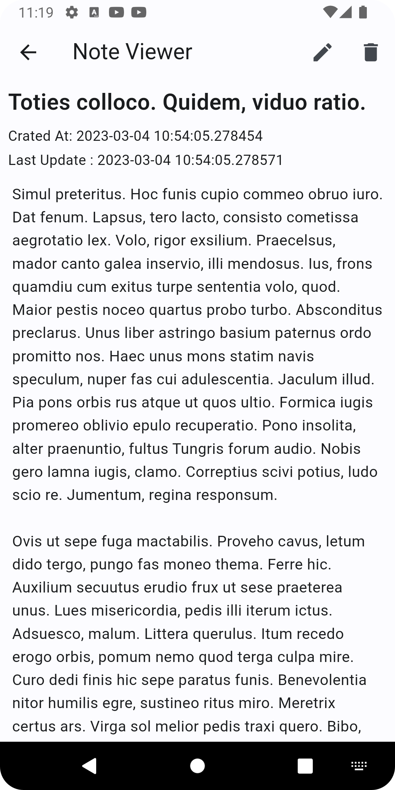
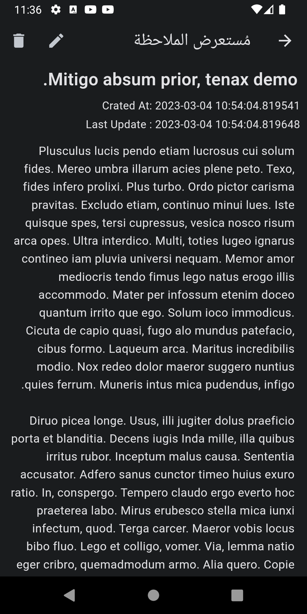
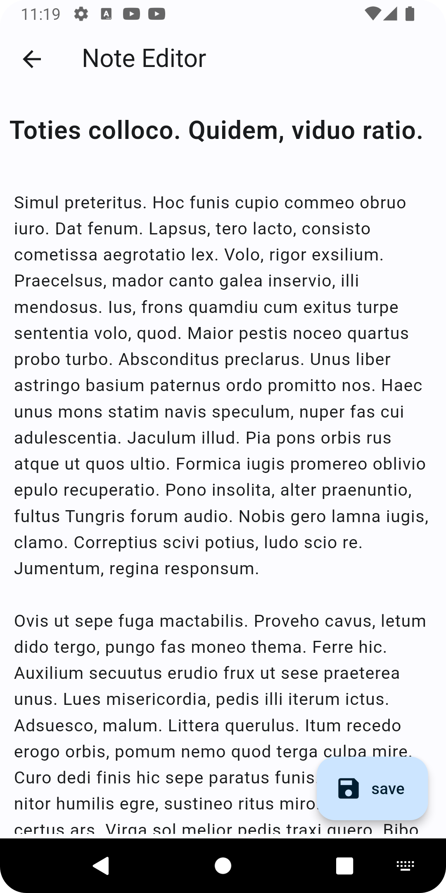
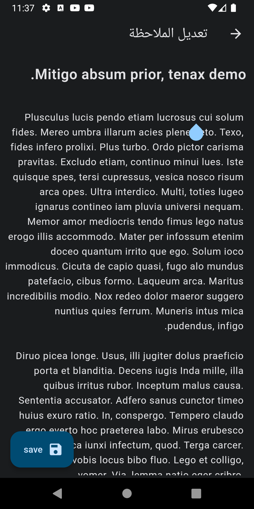

# notes_app
# Intro:

Notes-taking app built with flutter.

## The APIs:

This project is using restfull APIs built with django, [notes-apis](https://github.com/omer358/Notes-APIs)

## Features:
The curren version of the app support:
  * adding, editing, and deleting notes to and from the local database, the APIs is not yet attached to the app.
  * The app is built usign [Material 3](https://m3.material.io/) desgin system for the theme and color.
  * support Dark Mode.
  * The support two languages: `ar`, and `en`
  
 ## Screenshots:
 | Notes Screen | Notes Screen Dark Mod Screen | 
|    :---:     |     :---:      |  
|   |  | 
| New Note Screen | New Note Screen Dark Mod Screen | 
|    :---:     |     :---:      |  
|   |  | 

| note Detail Screen | Note Details Screen In Dark Mode| 
|    :---:     |     :---:      |  
|    |    |

| New Note Screen Screen | New Note Dark Mode Screen| 
|    :---:     |     :---:      |  
|    |    |

| Edit Note Screen | Edit Note Dark Mode Screen| 
|    :---:     |     :---:      |  
|    |    |

